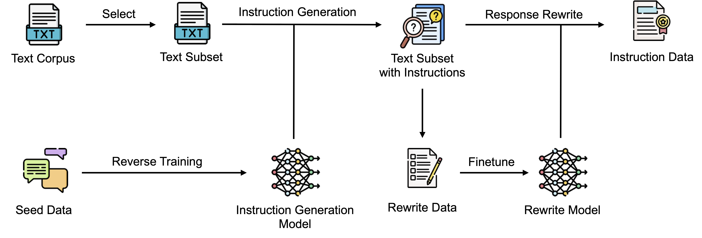
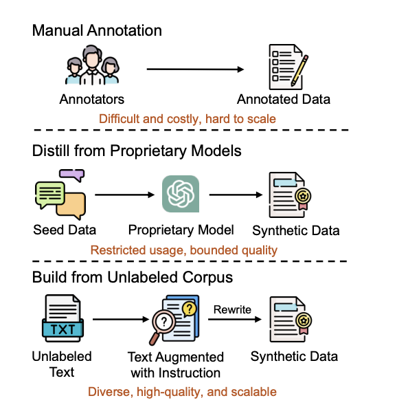

# Building Instruction Data from Unlabeled Corpus

This is our re-implementation of the paper "REInstruct: Building Instruction Data from Unlabeled Corpus".
This paper introduces REInstruct, a novel method for automatically building high-quality instruction data from unlabeled text corpora without heavy reliance on proprietary large language models (LLMs) or extensive human annotation. The authors propose a simple and scalable approach that addresses the challenges of manually annotating instruction data, which is typically difficult, costly, and hard to scale.



## Exisitng VS REInstruct

#### Manual Annotation
Relies on human experts.
Accurate but time-consuming, expensive, and hard to scale.

#### Distillation from Proprietary Models
Generates synthetic data using pre-trained models.
Limited by restricted access and variable quality.

#### Building from Unlabeled Corpus (REInstruct)
Automates task generation from raw text.
Cost-effective, scalable, and diverse data creation.

Manual annotation, while accurate, is prohibitively expensive and not scalable. Synthetic data distillation from proprietary models faces challenges of restricted access and variable data quality. In contrast, REInstruct leverages unlabeled corpora and an automated pipeline to produce diverse, high-quality datasets that are scalable and cost-effective. It represents a significant step forward in democratizing NLP advancements.




## Installation Instructions

To install the necessary dependencies, use the following commands:

Language:
```
python = >=3.8

```
Dependencies:
```
    torch==2.1.2,
    transformers==4.37.0,
    accelerate==0.26.1,
    datasets,
    fire,
    wandb,
    spacy,
    benepar,
    plotly,
    kaleido,
```

## Prepare Unlabeled Texts

Start by downloading the [C4 dataset](https://huggingface.co/datasets/allenai/c4) and decompress the text files in the `en` folder. Use the following script to select the candidate texts:

```bash
python re_instruct/data/prepare_unlabeled_texts.py \
    --c4_en_dir <path_to_c4_en_folder> \
    --output_dir <output_dir>
```

## Training the Model

For fine-tuning the model, you can use the following script:

```bash

torchrun --nproc_per_node=8 --master_port=2404 re_instruct/train/sft.py \
    --data_path data/dummy_instruction_data.json \
    --model_name_or_path huggyllama/llama-7b \
    --model_max_length 2048 \
    --output_dir exps/dummy_sft \
    --max_steps 100 \
    --per_device_train_batch_size 1 \
    --gradient_accumulation_steps 16 \
    --bf16 True \
    --evaluation_strategy no \
    --save_strategy steps \
    --save_steps 50 \
    --save_only_model True \
    --optim adamw_torch \
    --learning_rate 2e-5 \
    --lr_scheduler_type constant \
    --fsdp "full_shard auto_wrap" \
    --tf32 True \
    --gradient_checkpointing True \
    --report_to wandb \
    --run_name dummy_sft \
    --logging_steps 1

```

## Running Inference

To run inference, use the following command:

```bash

accelerate launch --num_processes=8 re_instruct/inference/generate_output.py \
    --data_path data/dummy_instruction_data.json \
    --model_name_or_path <path_to_trained_checkpoint> \
    --output_dir exp_data/dummy_inference \
    --prompt_type <prompt_type> \
    --max_new_tokens 512 \
    --do_sample False

```

## Filtering Rewritten Responses

To filter out any failed rewritten responses, use the following script:

```bash

python re_instruct/data/filter_rewritten.py \
    --data_path <path_to_data_for_filtering> \
    --output_dir <output_dir> \
    --remove_refusal True

```

## Visualizing with Sunburst

To visualize instructions using a sunburst plot, first, install the necessary dependencies from [Install required dependency](https://github.com/nikitakit/self-attentive-parser#installation) and visualize instructions using the following scripts:

```bash

python re_instruct/data/sunburst_visualize.py \
    --data_path example.json \
    --output_svg_path example.svg

```
